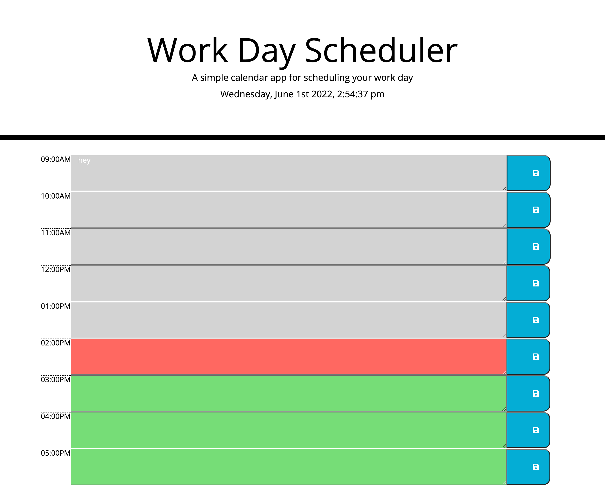

# Scheduling-Assistant
keep track of your schedule with this editable calendar application 

[LIVE SITE](https://hreichgelt.github.io/Scheduling-Assistant/)

## TABLE OF CONTENTS

1. [Description](#description)
2. [Usage](#USAGE)
3. [Visuals](#visuals)
4. [Authors Acknowledgments](#authors-and-acknowledgments)
4. [Resources](#resources)

## DESCRIPTION 
This is a schedule assistant where you can enter to-do-items into each hour section and save to local storage. This data will be saved even when the browser is closed. The local day, date, and time is displayed at the top and the hours are color-coded into past, present, future. 

## USAGE 
To use this application, just enter to-do-items into the text area for the time needed, click the save button on the right and you are done. 

## VISUALS 

## AUTHORS AND ACKNOWLEDGMENTS
Hans Reichgelt
Instructional Staff for coding bootcamp
John Titus - Tutor

## RESOURCES 
1. [LIVE SITE](https://hreichgelt.github.io/Scheduling-Assistant/)

2. [REPOSITORY](https://github.com/Hreichgelt/Scheduling-Assistant)

